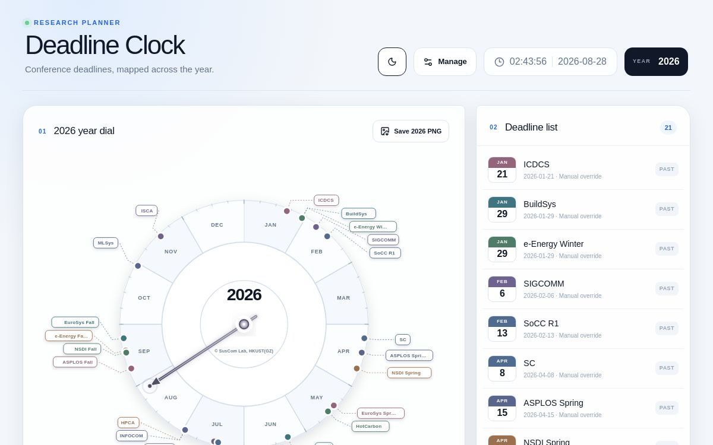

# Deadline Clock

[](LICENSE)
[](package.json)

An interactive year dial for tracking research conference deadlines. Deadline Clock combines a circular calendar, a chronological deadline list, source-aware deadline updates, and a high-resolution image export in a responsive web app.



## Features

- Circular annual calendar with month sectors and collision-aware conference labels
- Light and dark themes
- Conference labels linked to official conference websites
- High-resolution PNG export without the live date pointer
- Manual conference creation and CSV batch import
- Automatic deadline lookup with source and status metadata
- Previous-year estimation when a current deadline is unavailable
- Manual deadline overrides that are protected from automatic refresh
- Responsive desktop and mobile layouts

## Deadline data model

Each managed conference needs only a name and research field. The resolver checks the project's curated records first and then queries the open-source [CCF-Deadlines](https://github.com/ccfddl/ccf-deadlines) dataset.

Results are labelled as:

| Status | Meaning |
| --- | --- |
| `sourced` | A deadline was found for the target year. |
| `estimated` | The previous official deadline was shifted forward by one year. |
| `manual` | A user supplied the deadline; automatic refresh will not overwrite it. |
| `pending` | No usable deadline was found. |

The clock uses the full-paper submission deadline as its primary date. Abstract or registration deadlines are retained as separate metadata. Always verify an automatically sourced or estimated date against the official call for papers before submission.

## Quick start

### Requirements

- Node.js 22.13 or later
- npm

```bash
git clone https://github.com/guomingtang/deadline-clock.git
cd deadline-clock
npm ci
npm run dev
```

Then open the local URL shown in the terminal.

The clock can display its bundled fallback dataset without persistent storage. Conference management, imports, and automatic refresh require a Cloudflare D1 database bound as `DB`.

## Database setup

For a fully functional deployment:

1. Create a Cloudflare D1 database.
2. Bind it to the application using the binding name `DB`.
3. Apply the SQL migrations in [`drizzle/`](drizzle/).
4. Start or deploy the application with the D1 binding available.

The repository's OpenAI Sites deployment uses [`.openai/hosting.json`](.openai/hosting.json) to declare the same `DB` binding. When deploying elsewhere, configure the equivalent D1 binding in that platform's Cloudflare/Wrangler configuration.

## Add conferences

Open **Manage** in the application and enter:

- Conference name
- Research field

The application will attempt to resolve the deadline and its official website. You can edit the name, field, or deadline later; saving a date manually changes the status to `manual`.

For batch import, upload a UTF-8 CSV file with this format:

```csv
name,field
SIGCOMM,Computer Networks
NeurIPS,Machine Learning
```

A ready-to-edit example is available at [`examples/conferences.csv`](examples/conferences.csv). The importer accepts up to 100 rows at a time.

## Useful commands

| Command | Purpose |
| --- | --- |
| `npm run dev` | Start the development server. |
| `npm run build` | Create a production build. |
| `npm run lint` | Run ESLint. |
| `npm test` | Run the production build and test suite. |
| `npm run db:generate` | Generate Drizzle migration files after schema changes. |

## Project structure

```text
app/                  Pages and API routes
components/           Reusable UI components
db/                   D1/Drizzle schema and database helpers
drizzle/              SQL migrations
lib/deadline-search.ts Deadline resolution logic
examples/             Import examples
tests/                Build and UI checks
```

## Contributing

Issues and pull requests are welcome. Before submitting a change:

1. Keep deadline sources traceable and prefer official CFP pages.
2. Keep full-paper and abstract deadlines in separate fields.
3. Run `npm run lint` and `npm test`.
4. Include a short explanation and screenshots for visible UI changes.

## License

Licensed under the [Apache License 2.0](LICENSE). See [`NOTICE`](NOTICE) for attribution.
